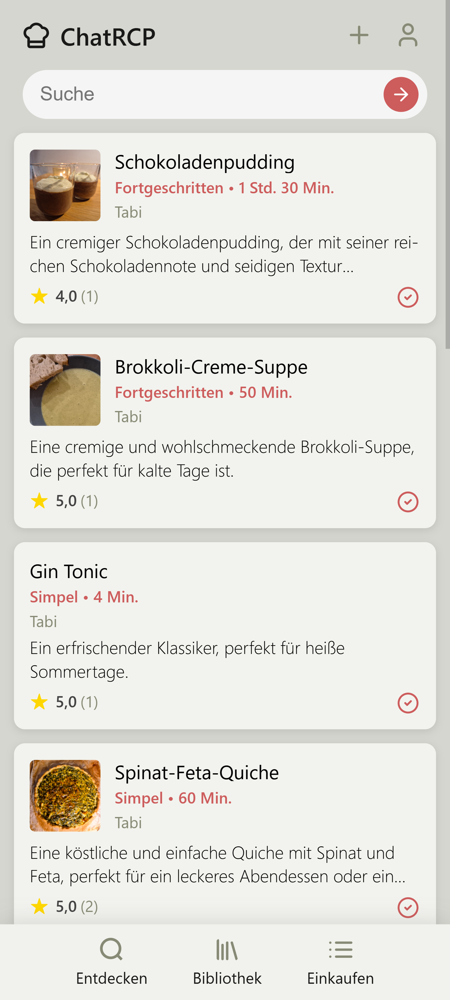
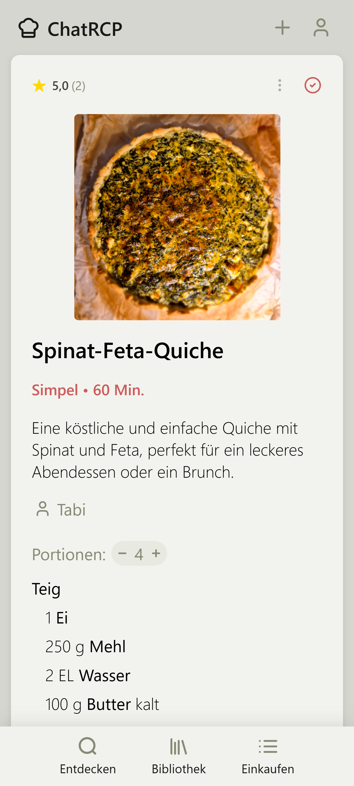
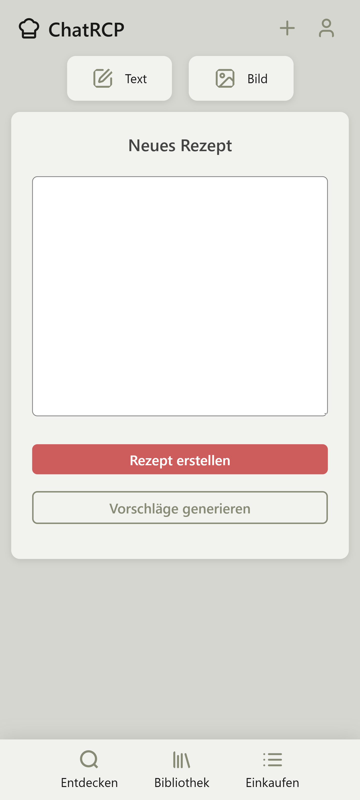
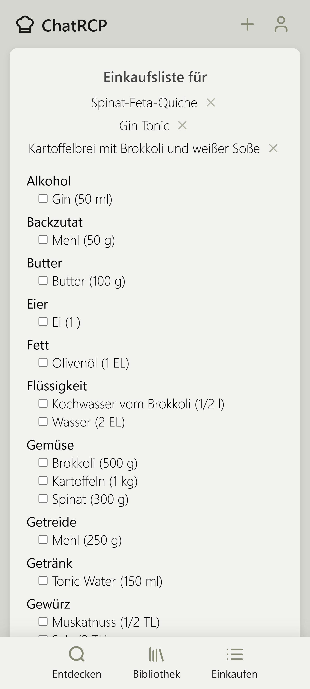

# ChatRCP: AI-Powered Recipe Platform

[ChatRCP](https://chatrcp.de) is a mobile-first web application that combines AI-powered recipe generation with social features, allowing users to create, share, and discover recipes. The app leverages the Mistral Large Language Model to generate personalized recipes and provides a rich set of features for recipe management and social interaction.

 

<table>
  <tr>
    <td></td>
    <td></td>
    <td></td>
    <td></td>
  </tr>
</table>

*Library view, detail view, recipe creation, and shopping list*

 

*Detail view of a recipe on desktop screen*

 

## Current Release

ChatRCP is currently in beta release and actively being used. The platform offers:
- Full recipe generation capabilities
- User accounts and social features
- Mobile-optimized interface
- Recipe sharing and rating system
- Shopping list management
 

## Key Features

### AI-Powered Recipe Generation
- Generate complete recipes from text descriptions or photos (of food or recipes)
- Intelligent recipe suggestions based on user input (e.g. diet or ingredients)

### Social Platform
- User profiles with customizable profile pictures
- Follow other users ('chefs')
- Share and rate recipes

### Recipe Management
- Personal library with favorite recipes
- Comprehensive recipe search
- Recipe editing and image uploads

### Shopping & Organization
- Add recipes to your shopping list
- Automatic ingredient type sorting
 

## Technical Implementation

### Architecture
- **Backend Framework**: Django (Python)
- **Database**: SQLite (PostgreSQL migration planned)
- **Frontend**: HTML5, CSS3, Vanilla JavaScript
- **AI Integration**: Mistral LLM via API
- **Deployment**: Docker containerization

### Key Technical Features
- Mobile-first responsive design
- RESTful API architecture
- Containerized deployment
- Efficient database queries
- Secure user authentication
- Image processing and storage
- External API integration

### Deployment
The application is containerized using Docker, enabling:
- Simple deployment process
- Easy updates via repository pulls
- Consistent environment across deployments
 

## Future Development

While ChatRCP is already serving users in its alpha release, planned improvements include:
- Migration to PostgreSQL for enhanced search capabilities
- Advanced recipe recommendation system
- Differentiate between food and drinks
- Add menu creation (collection of recipes)
- Community features based on user feedback
- Create native mobile app to further improve user experience
 

## About the Developer

This project was contrived, developed and conducted by me, Tobias Uihlein, as a demonstration of my full-stack development capabilities, including:
- Web application architecture
- AI integration
- User experience design
- Database design
- Docker containerization
- Production deployment
 

## Contact & Contributing

For any inquiries or collaboration opportunities, please reach out to me.
